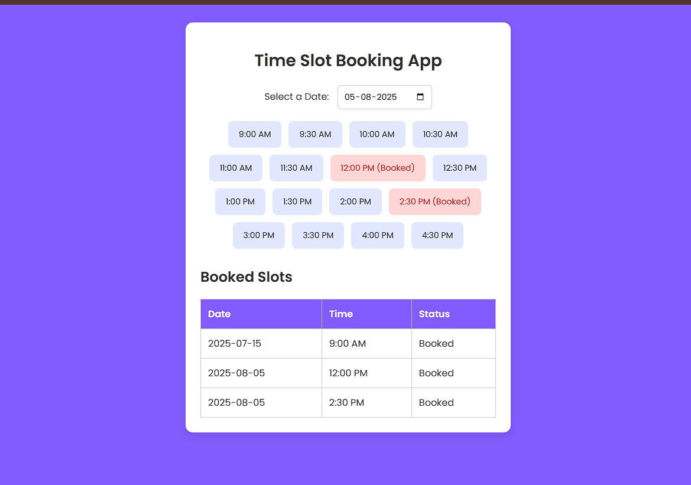

# Time Slot Booking App

A simple and interactive web application for booking time slots. This project is built with vanilla JavaScript, HTML, and CSS, and it was created as a learning exercise for web development.

## Description

This application allows users to select a date and book available time slots. Booked slots are saved in the browser's local storage, so the booking information persists even after the page is refreshed. Users can also view all their booked slots in a table and cancel them.

## Features

  * **Date Selection**: Users can pick a date to see the available time slots for that day.
  * **Time Slot Booking**: Users can click on an available time slot to book it.
  * **Booking Confirmation**: A modal pops up to confirm the booking before it is finalized.
  * **View Booked Slots**: All booked slots are displayed in a table with their corresponding date, time, and status.
  * **Cancel Booking**: Users can cancel a booked slot, which will then become available again.
  * **Persistent Storage**: Booking information is saved in the browser's local storage, so bookings are not lost on page reload.
  * **Responsive Design**: The application is designed to be usable on different screen sizes.

## Technologies Used

  * **HTML5**
  * **CSS3**
  * **JavaScript (ES6)**

Screenshots


## How to Use

1.  **Clone the repository:**

    ```bash
    git clone https://github.com/your-username/time-slot-booking.git
    ```

2.  **Navigate to the project directory:**

    ```bash
    cd time-slot-booking
    ```

3.  **Open the `index.html` file in your browser.**

    You can do this by double-clicking the file or right-clicking and selecting "Open with" your preferred browser.

## Project Structure

```
.
├── index.html       # The main HTML file
├── styles.css       # The stylesheet for the application
└── script.js        # The JavaScript file with the application logic
```
